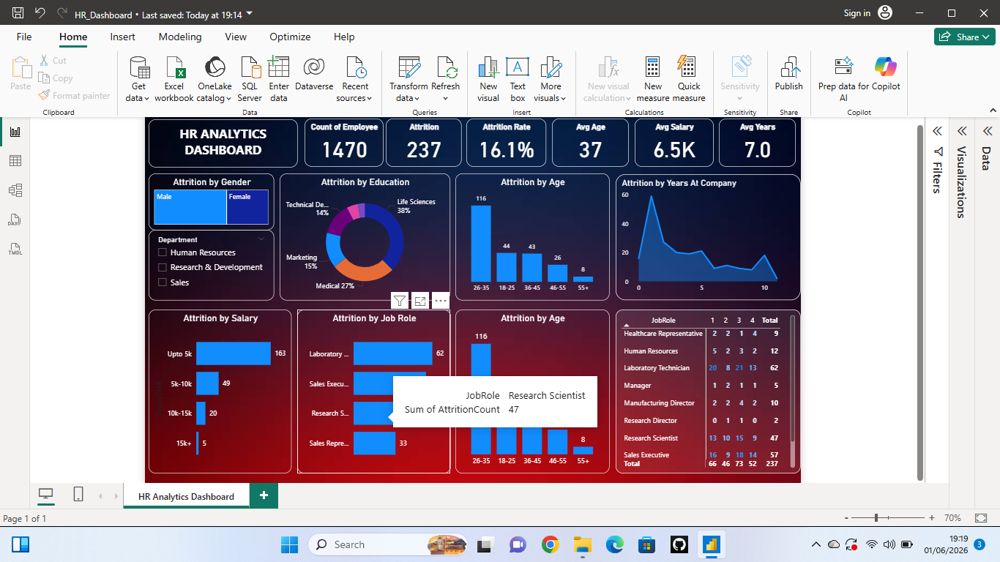

# HR Analytics Dashboard

## 📊 Project Overview

The HR Analytics Dashboard is a Power BI project created to analyze employee attrition and workforce trends. The dashboard helps organizations understand the major factors affecting employee retention and performance through interactive visualizations and KPIs.

## 🎯 Objective

The main objective of this project is to help organizations:

* Improve employee performance
* Improve employee retention
* Reduce employee attrition
* Make data-driven HR decisions

## 🛠️ Tools & Technologies Used

* Power BI
* DAX
* Data Cleaning
* Data Modeling
* Data Visualization

## 📌 Key KPIs

* Total Employee Count
* Attrition Count
* Attrition Rate
* Average Salary
* Average Age
* Average Years at Company

## 📈 Dashboard Insights

The dashboard provides insights based on:

* Gender-wise Attrition
* Education-wise Attrition
* Age Group Analysis
* Salary-wise Attrition
* Job Role Analysis
* Years at Company Analysis

## 🚀 Skills Gained

Through this project, I improved my skills in:

* Dashboard Designing
* Data Analysis
* DAX Calculations
* Interactive Visualizations
* Analytical Thinking

Day by day, I am improving my analytical skills and learning how to convert raw data into meaningful business insights.

## 📷 Dashboard Preview

## 📬 Feedback

Feedback and suggestions are always welcome!
